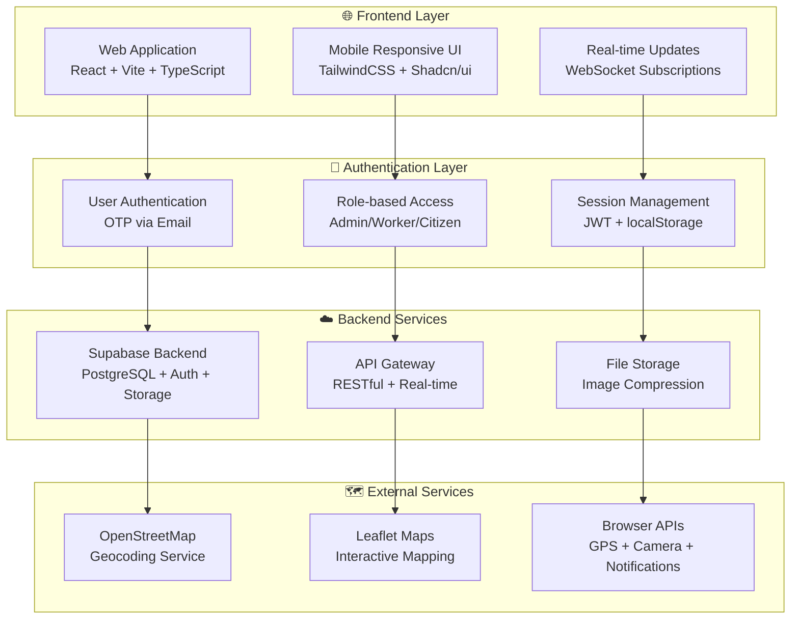
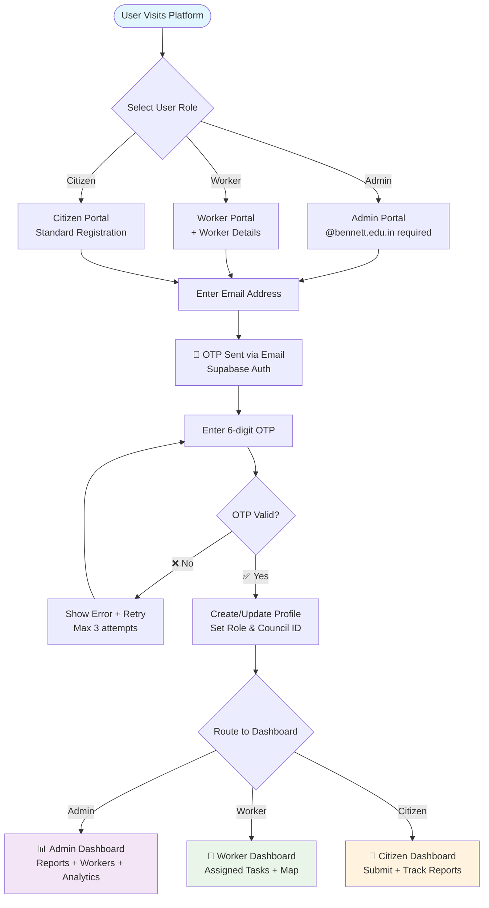
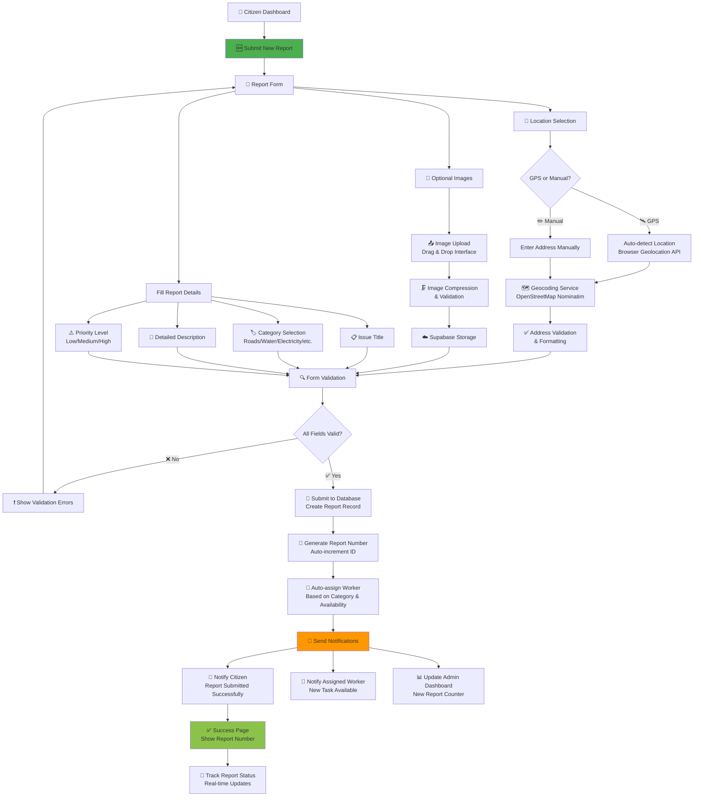
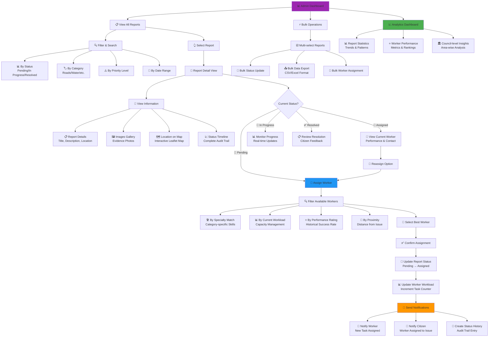
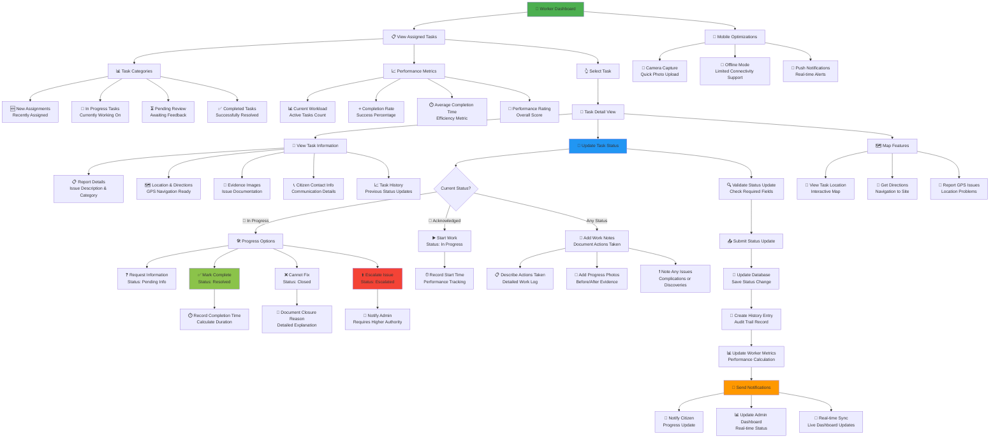
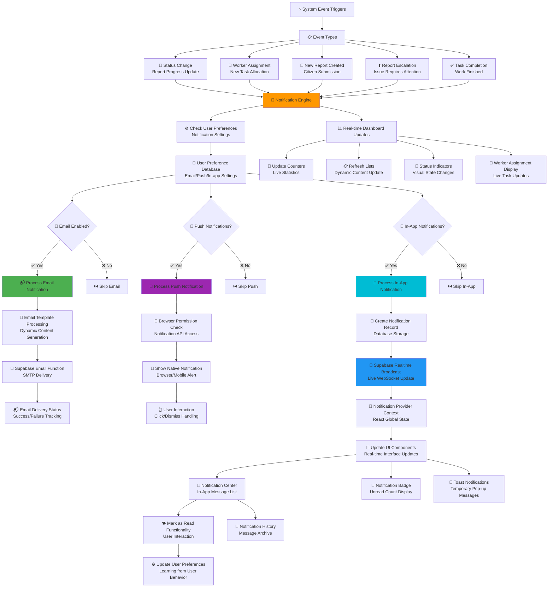
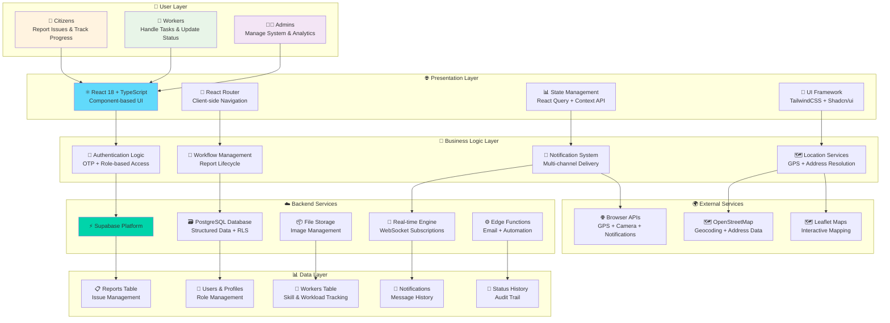

# Urban Reach

Urban Reach is a modern web application designed to streamline urban management, reporting, and worker assignments. Built with React, Vite, Tailwind CSS, and Supabase, it provides tools for citizens and workers to interact, report issues, and manage city operations efficiently.

## 🏗️ System Architecture & Workflow

### Process Flow Architecture



### User Journey Flowcharts

#### 1. 🔐 Authentication & Onboarding Flow



#### 2. 📝 Report Submission Flow (Citizen Journey)



#### 3. 👨‍💼 Admin Management Flow



#### 4. 👷‍♂️ Worker Task Management Flow



#### 5. 🔔 Notification & Real-time System Flow



### 🏗️ Technical Architecture Overview



## Features
- **🔐 Multi-Role Authentication:** Secure OTP-based login for Citizens, Workers, and Admins
- **📝 Intelligent Report Management:** Submit, track, and manage municipal issues with automatic worker assignment
- **👷 Worker Task System:** Specialized worker dashboards with performance tracking and workload management  
- **🗺️ Advanced Location Services:** GPS integration, interactive maps, and geocoding for precise issue location
- **📱 Real-time Notifications:** Multi-channel notifications (email, push, in-app) with user preferences
- **📊 Analytics & Insights:** Comprehensive dashboards with performance metrics and trend analysis
- **⚡ Bulk Operations:** Efficient data export, bulk status updates, and batch processing
- **📸 Media Management:** Image upload with compression, galleries, and evidence documentation
- **🔄 Live Updates:** Real-time synchronization across all user interfaces using WebSocket technology

## Tech Stack
- **Frontend:** React 18 + TypeScript, Vite, TailwindCSS + Shadcn/ui
- **Backend:** Supabase (PostgreSQL + Auth + Storage + Real-time + Functions)
- **Mapping:** Leaflet + OpenStreetMap Nominatim for geocoding
- **State Management:** React Query + Context API
- **Authentication:** Supabase Auth with OTP email verification
- **Real-time:** WebSocket subscriptions for live updates
- **File Handling:** Supabase Storage with image compression
- **Deployment:** Vercel with optimized build configuration

## 🚀 Live Demo
Visit the live application: **[https://urban-reach-1.vercel.app/](https://urban-reach-1.vercel.app/)**

### Test Accounts
- **Citizen Portal:** `/auth/citizen` - Use any email for testing
- **Worker Portal:** `/auth/worker` - Requires worker registration  
- **Admin Portal:** `/auth/admin` - Requires @bennett.edu.in email

## 📁 Project Structure
```
urban-reach/
├── 📁 src/
│   ├── 📁 components/          # Reusable UI components
│   │   ├── ui/                 # Shadcn/ui base components
│   │   ├── AuthForm.tsx        # Authentication interface
│   │   ├── ReportsMap.tsx      # Interactive mapping
│   │   ├── WorkerAssignment.tsx # Worker allocation system
│   │   ├── StatusUpdate.tsx    # Task status management
│   │   ├── NotificationCenter.tsx # Real-time notifications
│   │   └── ImageUpload.tsx     # File upload with compression
│   ├── 📁 pages/               # Application page components
│   │   ├── Dashboard.tsx       # Admin overview
│   │   ├── CitizenDashboard.tsx # Citizen interface
│   │   ├── WorkerDashboard.tsx # Worker task management
│   │   ├── SubmitReport.tsx    # Issue submission form
│   │   └── ReportDetail.tsx    # Detailed report view
│   ├── 📁 hooks/               # Custom React hooks
│   │   ├── useGeocoding.ts     # Location services
│   │   ├── useRealtimeSubscription.ts # Live updates
│   │   └── useNetworkStatus.ts # Connectivity monitoring
│   ├── 📁 lib/                 # Utility libraries
│   │   ├── geocoding.ts        # Address resolution
│   │   ├── notifications.ts    # Message handling
│   │   ├── storage.ts          # File management
│   │   └── error-handling.ts   # Error management
│   └── 📁 integrations/        # External service integrations
│       └── supabase/           # Database & auth configuration
├── 📁 supabase/               # Backend configuration
│   ├── 📁 migrations/         # Database schema evolution
│   ├── 📁 functions/          # Edge functions (email automation)
│   └── config.toml            # Supabase project settings
├── 📁 public/                 # Static assets
└── 📁 docs/                   # Documentation files
```

## 🛠️ Development Setup

### Prerequisites
- Node.js 18+ and npm/yarn
- Supabase account and project
- Modern web browser with WebSocket support

### Installation Steps
1. **Clone the repository:**
   ```bash
   git clone https://github.com/ydvSajal/urban-reach.git
   cd urban-reach
   ```

2. **Install dependencies:**
   ```bash
   npm install
   ```

3. **Environment Configuration:**
   Create `.env.local` file with Supabase credentials:
   ```env
   VITE_SUPABASE_URL=your_supabase_project_url
   VITE_SUPABASE_PUBLISHABLE_KEY=your_supabase_anon_key
   ```

4. **Database Setup:**
   Run the included migrations to set up the database schema:
   ```bash
   npx supabase db reset
   ```

5. **Start development server:**
   ```bash
   npm run dev
   ```

6. **Open in browser:**
   Navigate to `http://localhost:8080`

## 🗄️ Database Schema

### Core Tables
- **`profiles`** - User information with role-based access control
- **`reports`** - Municipal issue submissions with full lifecycle tracking  
- **`workers`** - Worker profiles with specialization and performance metrics
- **`councils`** - Municipal council management (Bennett University)
- **`notifications`** - Multi-channel notification system with preferences
- **`report_status_history`** - Complete audit trail for all status changes
- **`worker_specialties`** - Skill categorization for optimal task assignment

### Key Features
- **Row Level Security (RLS)** for data protection and privacy
- **Automated triggers** for performance calculation and auto-assignment
- **Real-time subscriptions** for live dashboard updates
- **Comprehensive indexing** for optimal query performance

## 🤝 Contributing

We welcome contributions to Urban Reach! Here's how you can help:

### Development Guidelines
1. **Fork the repository** and create a feature branch
2. **Follow the existing code style** and use TypeScript
3. **Add tests** for new features and ensure existing tests pass
4. **Update documentation** for any API or workflow changes
5. **Submit a pull request** with a clear description of changes

### Code Quality Standards
- ESLint configuration for code consistency
- TypeScript for type safety and better development experience
- Component testing with React Testing Library
- Comprehensive error handling and user feedback

### Areas for Contribution
- 🔧 **Feature Development:** New workflows and user interface improvements
- 🐛 **Bug Fixes:** Issue resolution and performance optimizations  
- 📚 **Documentation:** Guides, tutorials, and API documentation
- 🧪 **Testing:** Unit tests, integration tests, and user acceptance testing
- 🎨 **UI/UX:** Design improvements and accessibility enhancements

## 📚 Documentation

### Additional Resources
- **[Geocoding Service Guide](docs/geocoding-service.md)** - Location services implementation
- **[Supabase Email Setup](docs/supabase-email-template-config.md)** - Email notification configuration
- **[Performance Optimizations](PERFORMANCE_OPTIMIZATIONS.md)** - System optimization strategies
- **[Implementation Summary](IMPLEMENTATION_SUMMARY.md)** - Detailed feature breakdown

### API References
- [Supabase Documentation](https://supabase.com/docs) - Backend services
- [React Query Guide](https://tanstack.com/query/latest) - Data fetching and caching
- [TailwindCSS](https://tailwindcss.com/docs) - Utility-first styling
- [Leaflet Maps](https://leafletjs.com/) - Interactive mapping

## 🔒 Security & Privacy

- **Row Level Security (RLS)** enforced at database level
- **Role-based access control** with strict permission boundaries
- **Input validation and sanitization** for all user data
- **Secure file upload** with type validation and size limits
- **Environment variable protection** for sensitive credentials

## 📊 Performance Features

- **Code splitting** with lazy-loaded routes for faster initial load
- **Image compression** for optimal storage and bandwidth usage
- **Optimistic updates** for immediate user feedback
- **Real-time synchronization** with minimal data transfer
- **Mobile optimization** with responsive design and touch interfaces

## 🌟 Future Roadmap

- 📱 **Mobile App Development** - Native iOS and Android applications
- 🤖 **AI-Powered Features** - Intelligent issue categorization and priority detection
- 📈 **Advanced Analytics** - Predictive modeling and trend analysis
- 🌍 **Multi-language Support** - Internationalization for broader accessibility  
- 🔗 **Third-party Integrations** - Government databases and mapping services

## 📄 License

This project is licensed under the **MIT License** - see the [LICENSE](LICENSE) file for details.

## 📞 Support & Contact

- **Issues:** [GitHub Issues](https://github.com/ydvSajal/urban-reach/issues)
- **Discussions:** [GitHub Discussions](https://github.com/ydvSajal/urban-reach/discussions)
- **Email:** Contact the development team for enterprise inquiries

---

<div align="center">

**🏙️ Built for Smart Cities | 🚀 Powered by Modern Web Technology | 💡 Open Source Innovation**

*Making urban management more efficient, transparent, and citizen-friendly.*

</div>
